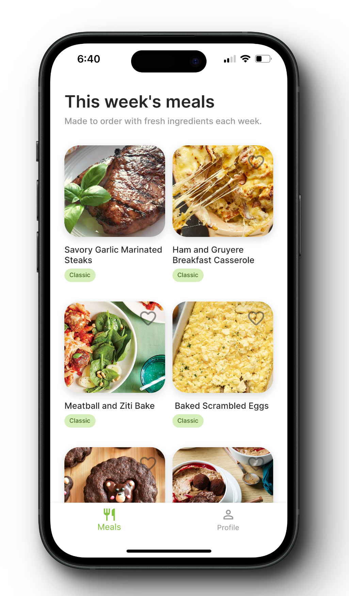
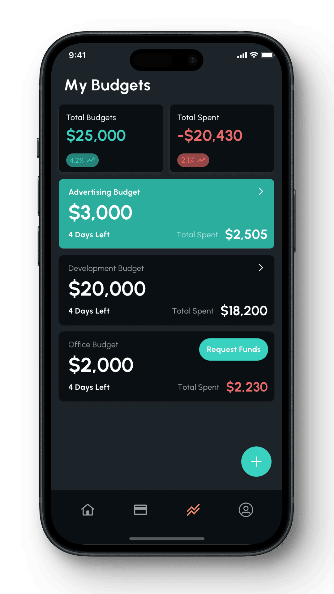
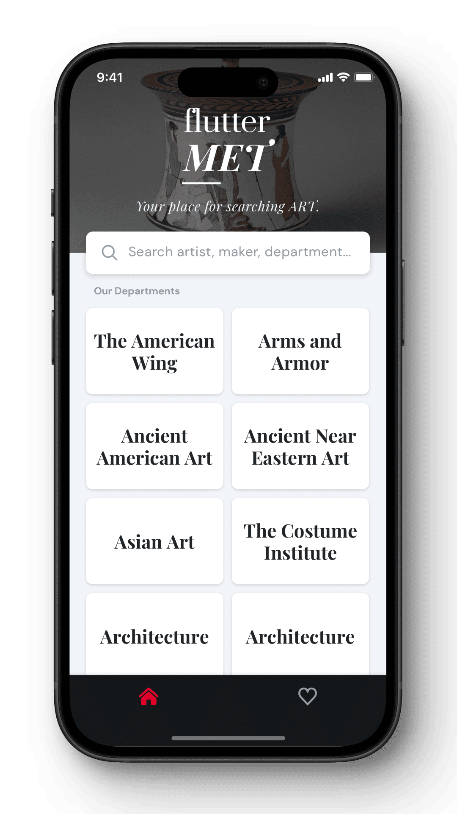
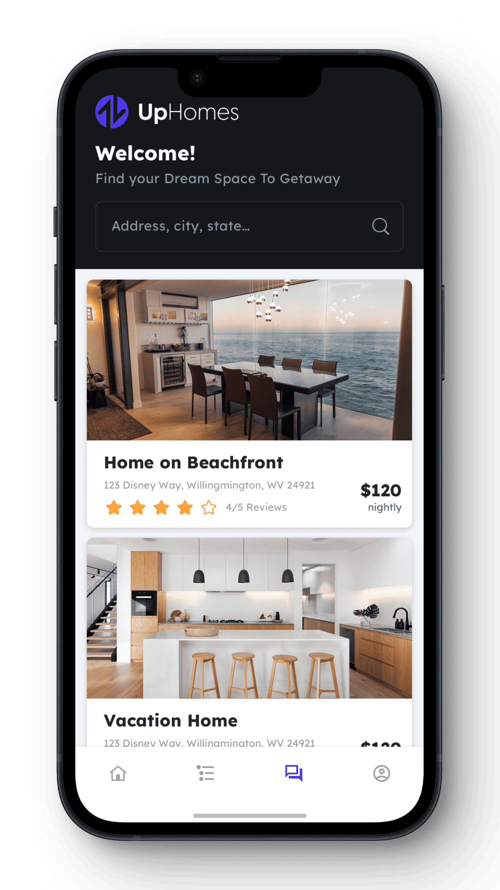
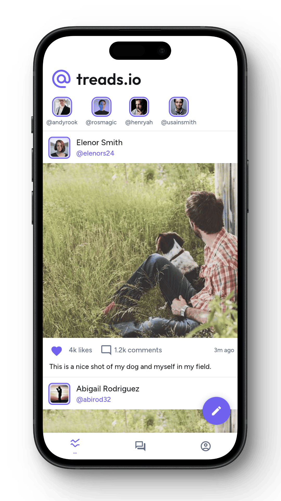

Below is a quick overview of our available sample apps. 

| Sample Screen                                  | App Description                                                                                                                                                                                                                               | Link to Repository                       |
|------------------------------------------------|-----------------------------------------------------------------------------------------------------------------------------------------------------------------------------------------------------------------------------------------------|------------------------------------------|
|  | **Meal Planner** An innovative meal preparation app for businesses, combining user-friendly design with advanced technology and Firebase integration. It allows users to specify dietary preferences and allergies, offering a highly personalised meal planning experience from the first interaction. | [View Repository](https://github.com/FlutterFlow/sample-apps/tree/main/meal_planner_sample) |
|       | **Fin Wallet** A secure banking app that provides a clear view of your account balances and transactions, offering a streamlined financial management experience.                                                                                                    | [View Repository](https://github.com/FlutterFlow/sample-apps/tree/main/fin_wallet_sample)    |
|     | **FlutterMet** An interactive app that allows users to explore and learn about the exhibits at the New York Metropolitan Museum, making art more accessible and engaging.                                                                                           | [View Repository](https://github.com/FlutterFlow/sample-apps/tree/main/flutter_met_sample)    |
|               | **UpHomes** A versatile multi-vendor marketplace app tailored for the real estate sector, designed to be adaptable for any two-sided marketplace needs. It includes features for chat communication, listing creation and management, ratings, and booking functionalities. | [View Repository](https://github.com/FlutterFlow/sample-apps/tree/main/up_homes_sample)       |
|           | **Treads.io (Pro Plans Only)** An exclusive social media platform designed for everyone, offering a unique space to create posts, stories, comments, and friends.                                                                                                   | [View Repository](https://github.com/FlutterFlow/sample-apps/tree/main/treads_social_sample)        |
